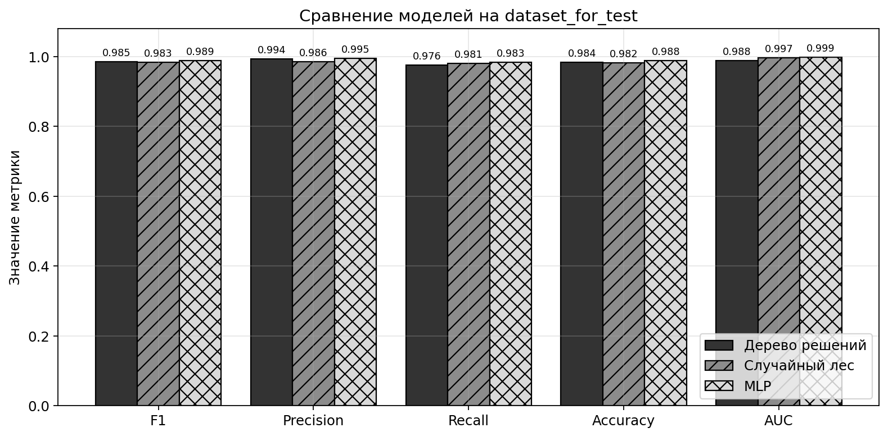
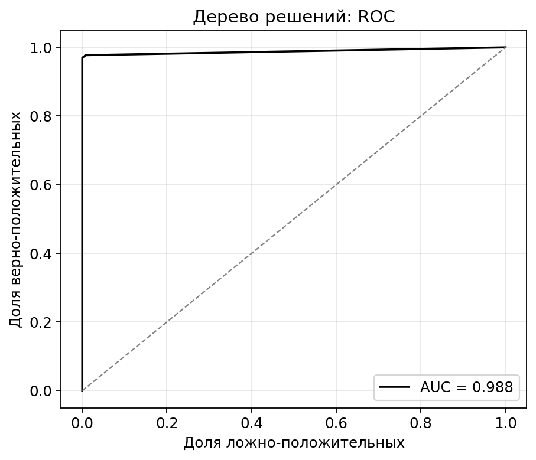
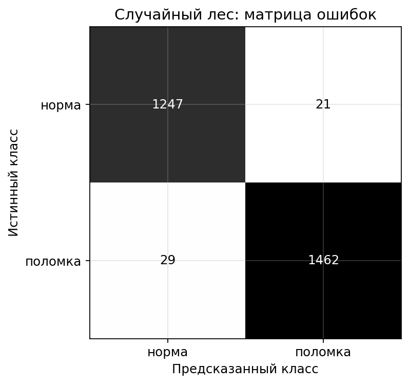
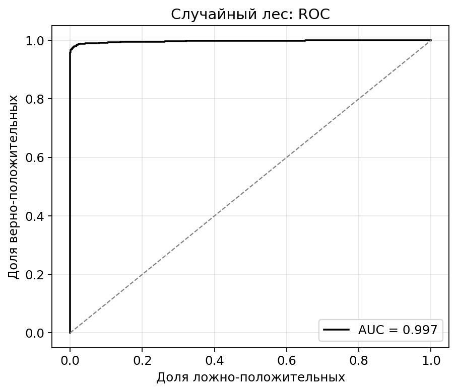
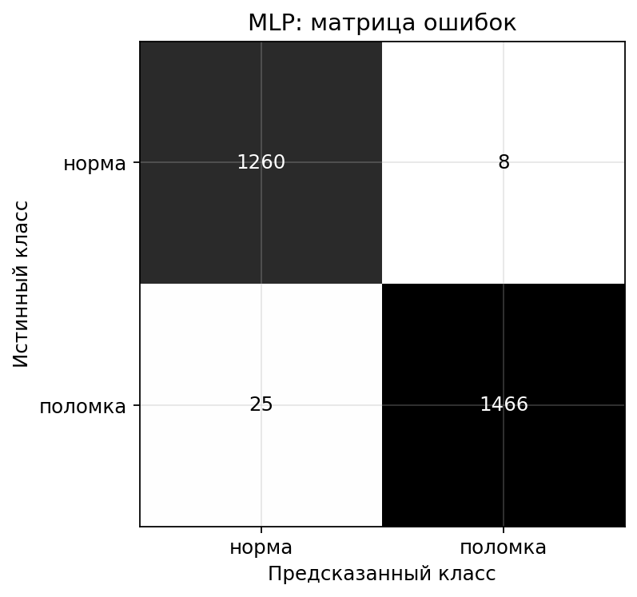
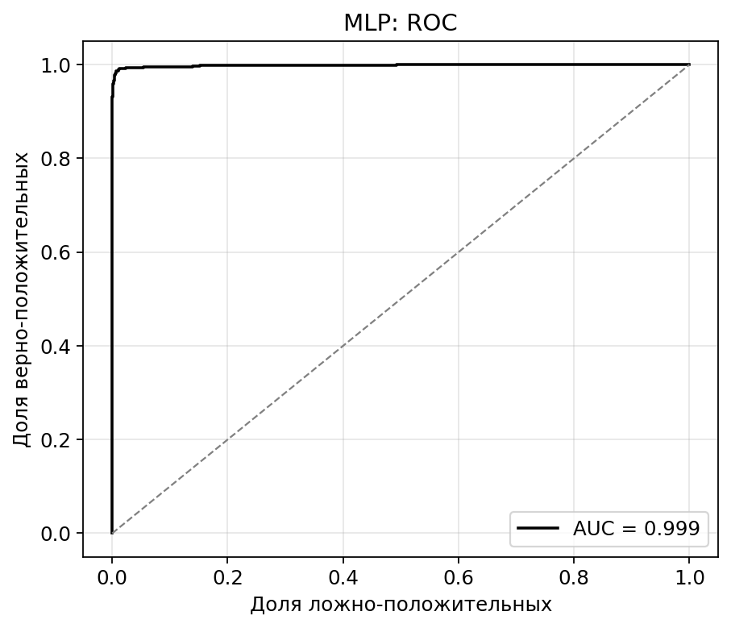

# Оценка моделей на независимой выборке dataset_for_test

Выборка собрана из полётов, которые не использовались ни в обучении, ни в валидации, ни в тесте: 10 деформированных полётов из исключённых при балансировке + нормальные полёты, добавленные отдельно. У нормальных полётов обрезаны по 20 % с каждого края (взлёт/посадка).

## Состав выборки

- окон всего: 2759;
- норма: 1268;
- поломка: 1491;
- уникальных полётов: 14.

## Сводная таблица

| Модель | F1 (поломка) | Precision | Recall | Accuracy | AUC |
|--------|--------------|-----------|--------|----------|-----|
| Дерево решений | 0.985 | 0.994 | 0.976 | 0.984 | 0.988 |
| Случайный лес | 0.983 | 0.986 | 0.981 | 0.982 | 0.997 |
| MLP | 0.989 | 0.995 | 0.983 | 0.988 | 0.999 |

## Сравнительный график



## Детальные отчёты

### Дерево решений

```
              precision    recall  f1-score   support

       норма      0.972     0.993     0.982      1268
     поломка      0.994     0.976     0.985      1491

    accuracy                          0.984      2759
   macro avg      0.983     0.984     0.984      2759
weighted avg      0.984     0.984     0.984      2759

```




### Случайный лес

```
              precision    recall  f1-score   support

       норма      0.977     0.983     0.980      1268
     поломка      0.986     0.981     0.983      1491

    accuracy                          0.982      2759
   macro avg      0.982     0.982     0.982      2759
weighted avg      0.982     0.982     0.982      2759

```





### MLP

```
              precision    recall  f1-score   support

       норма      0.981     0.994     0.987      1268
     поломка      0.995     0.983     0.989      1491

    accuracy                          0.988      2759
   macro avg      0.988     0.988     0.988      2759
weighted avg      0.988     0.988     0.988      2759

```




