# Раздел 2.4. Методы детектирования поломки винта по вибрационному сигналу

В эксперименте используются три независимых инструмента детектирования
поломки винта по вибрационному сигналу датчика Xsens MTi-30:

- **Decision Tree** — одиночное решающее дерево
  (`sklearn.tree.DecisionTreeClassifier`);
- **Random Forest** — ансамбль из решающих деревьев
  (`sklearn.ensemble.RandomForestClassifier`);
- **Многослойный перцептрон (MLP)** — нейронная сеть прямого
  распространения с L2-регуляризацией, обёрнутая в конвейер с
  `StandardScaler` (`sklearn.pipeline.Pipeline` +
  `sklearn.neural_network.MLPClassifier`).

Все три метода решают одну и ту же задачу бинарной классификации
вибрационного окна: «норма» против «поломка». На вход методам подаются
одинаковые признаки — каждое окно длиной **10 семплов** (0.1 с при
частоте 100 Гц) с шагом **5 семплов** описывается вектором из **46**
статистико-спектральных признаков (производные от `total_vibration`,
`rms_x`, `rms_y`, `rms_z`), рассчитываемых функцией `extract_features`
из модуля `features.py`. Окно в 0.1 с выбрано в соответствии с
требованием на задержку обнаружения поломки не более 100 мс.

## 2.4.1. Дерево решений

**Decision Tree** (дерево решений) — иерархическая структура из узлов.
В каждом внутреннем узле задаётся проверка вида «признак *x_i* ≤ *t*»;
в зависимости от результата проверки выборка идёт в левую или правую
ветвь. В терминальных узлах (листьях) хранится метка класса (норма или
поломка). При обучении на каждом шаге выбирается пара (признак, порог),
минимизирующая критерий неоднородности листа. Используется критерий
Джини (формула для LibreOffice Math):

```math
G(лист) = 1 - sum from{c in lbrace норма, поломка rbrace} p_c^2
```

где *p_c* — доля окон класса *c* в листе. Качество разбиения по
признаку *x_i* при пороге *t* определяется как взвешенная сумма
значений *G* по двум получающимся листам; выбирается пара
(*x_i*, *t*) с минимальной взвешенной суммой.

Подбор гиперпараметра `max_depth` выполнен по F1 на отдельной
валидационной выборке в диапазоне 2..20. Гиперпараметры обучения и
метрики на отложенной выборке приведены ниже (см. таблицы 2.2, 2.3).

**Таблица 2.2 — Гиперпараметры обучения Decision Tree**

| Параметр | Значение |
|----------|----------|
| Критерий | Gini |
| `max_depth` | 2 (выбрано по F1 на val) |
| `min_samples_leaf` | 10 |
| `class_weight` | balanced |
| `random_state` | 42 |

**Таблица 2.3 — Метрики Decision Tree на test (4 699 окон)**

| Метрика | Значение |
|---------|----------|
| F1 (поломка) | 0.995 |
| Precision (поломка) | 0.992 |
| Recall (поломка) | 0.998 |
| Accuracy | 0.997 |

Алгоритм обучения дерева представлен блок-схемой
`schemes/tree_train_scheme.json`. Сопутствующие артефакты обучения —
зависимость F1 от глубины дерева (рисунок 2.21), визуализация
итогового дерева (рисунок 2.22), важности признаков (рисунок 2.23),
пути решения для типовых окон нормы и поломки (рисунок 2.24) и матрица
ошибок на тесте (рисунок 2.25) — представлены ниже.

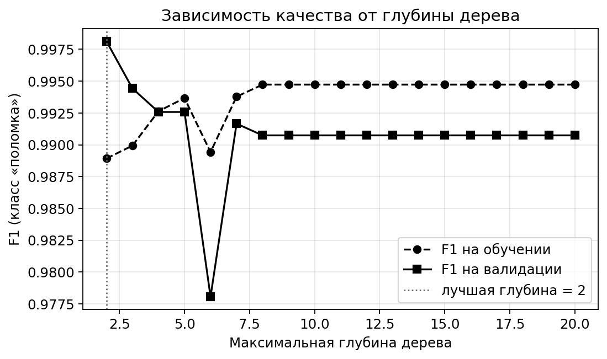

*Рисунок 2.21 — Зависимость F1-меры по классу «поломка» на обучающей и
валидационной выборках от максимальной глубины дерева*

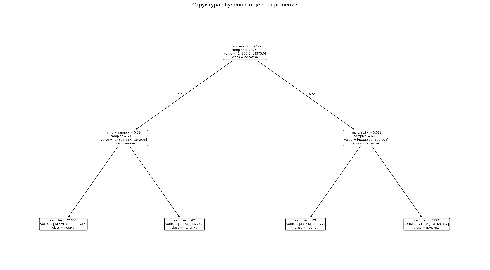

*Рисунок 2.22 — Структура итогового дерева решений*

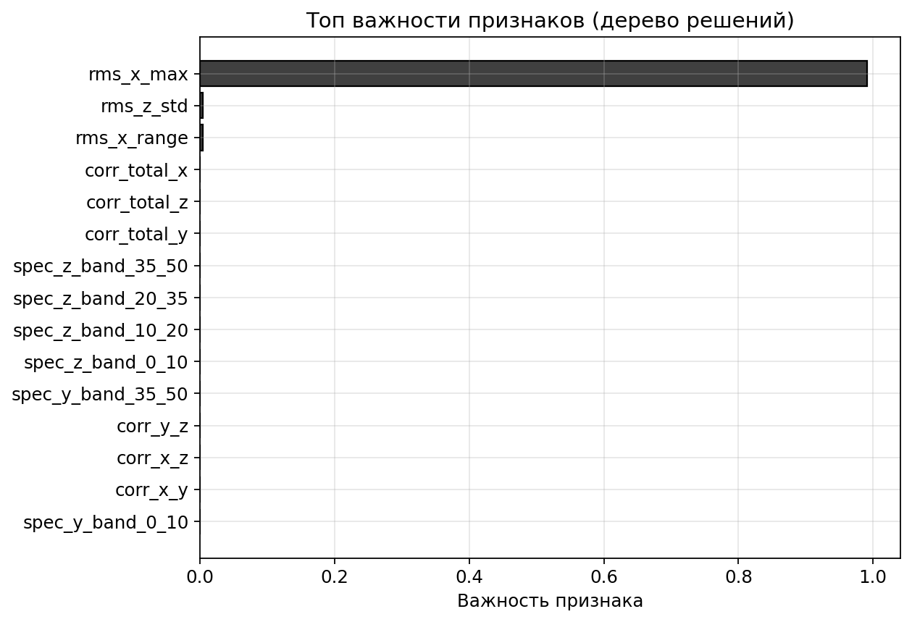

*Рисунок 2.23 — Топ-15 признаков по важности (Decision Tree)*


*Рисунок 2.24 — Пути от корня к листу для типовых окон нормы и поломки*

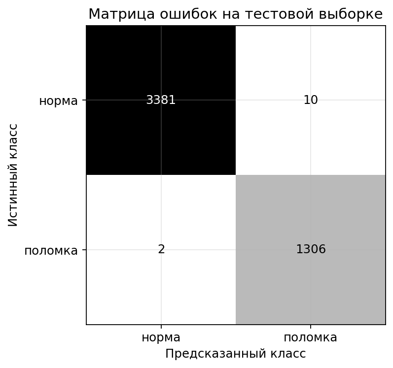

*Рисунок 2.25 — Матрица ошибок Decision Tree на отложенной выборке test*

## 2.4.2. Случайный лес

**Random Forest** — коллективный классификатор, построенный по принципу
бэггинга: одновременно обучается *T* независимых решающих деревьев,
а итоговая вероятность класса «поломка» получается усреднением
вероятностей деревьев (формула для LibreOffice Math):

```math
p_fault(x) = {1} over {T} cdot sum from{t=1} to{T} p_fault^{(t)} (x)
```

Случайность вносится двумя путями:

1. **Bootstrap-выборка.** Каждое дерево обучается на случайной выборке
   с возвращением того же размера, что и исходная — в среднем ≈63 %
   уникальных окон в каждом дереве.
2. **Random feature subset.** В каждом узле дерево рассматривает не
   все 46 признаков, а случайные ⌊√46⌋ ≈ 7. Это разрывает корреляции
   между деревьями и делает ансамбль разнообразным.

Гиперпараметры `n_estimators`, `max_depth`, `min_samples_leaf`
подобраны по F1 на валидационной выборке. Гиперпараметры обучения и
метрики на отложенной выборке приведены ниже (см. таблицы 2.4, 2.5).

**Таблица 2.4 — Гиперпараметры обучения Random Forest**

| Параметр | Значение |
|----------|----------|
| `n_estimators` | 25 (выбрано по F1 на val) |
| `max_depth` | 5 |
| `min_samples_leaf` | 1 |
| `max_features` | "sqrt" (≈ 7 признаков из 46) |
| `class_weight` | balanced_subsample |
| `n_jobs` | -1 (все ядра) |
| `random_state` | 42 |

**Таблица 2.5 — Метрики Random Forest на test (4 699 окон)**

| Метрика | Значение |
|---------|----------|
| F1 (поломка) | 0.998 |
| Precision (поломка) | 0.996 |
| Recall (поломка) | 0.999 |
| Accuracy | 0.999 |
| ROC-AUC | 1.000 |

Алгоритм обучения леса представлен блок-схемой
`schemes/forest_train_scheme.json`. Сопутствующие артефакты обучения —
зависимость F1 от числа деревьев (рисунок 2.26), кривые валидации по
`max_depth` и `min_samples_leaf` (рисунок 2.27), важности признаков
(рисунок 2.28), матрица ошибок (рисунок 2.29) и ROC-кривая
(рисунок 2.30) — представлены ниже.

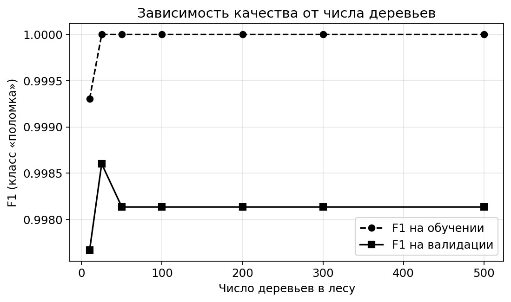

*Рисунок 2.26 — Зависимость F1-меры по классу «поломка» от числа
деревьев в лесу на обучающей и валидационной выборках*

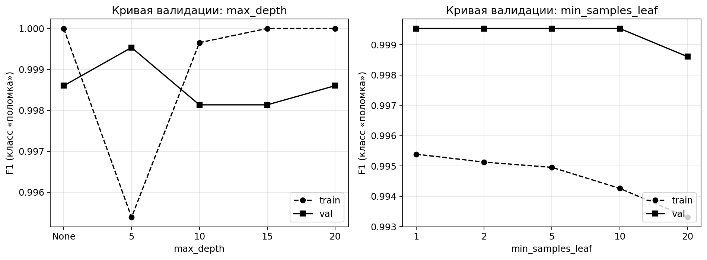

*Рисунок 2.27 — Кривые валидации Random Forest по гиперпараметрам
`max_depth` и `min_samples_leaf`*

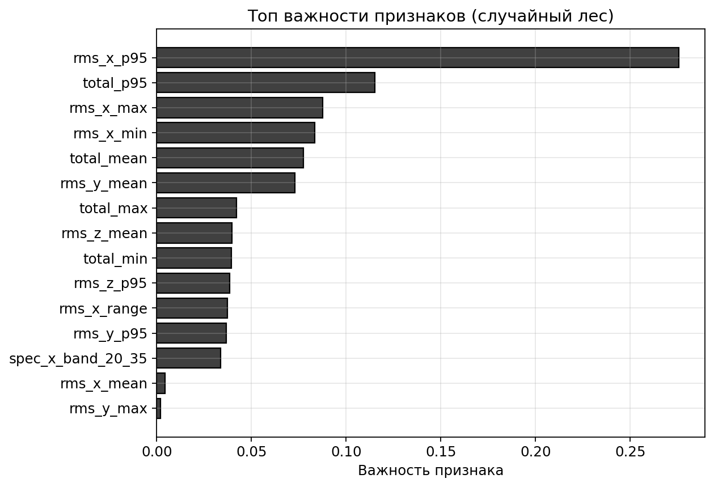

*Рисунок 2.28 — Топ-15 признаков по важности (Random Forest)*


*Рисунок 2.29 — Матрица ошибок Random Forest на отложенной выборке test*


*Рисунок 2.30 — ROC-кривая Random Forest на отложенной выборке test*

## 2.4.3. Многослойный перцептрон

**Многослойный перцептрон** — нейронная сеть прямого распространения,
в которой каждый нейрон скрытого слоя вычисляет взвешенную сумму своих
входов и пропускает её через нелинейную функцию активации (формулы для
LibreOffice Math):

```math
h^{(l)} = sigma left( W^{(l)} cdot h^{(l-1)} + b^{(l)} right)
```

```math
sigma(z) = max(0, z) ~~ [ReLU]
```

В отличие от Decision Tree и Random Forest, граница «норма/поломка»
задаётся непрерывной нелинейной функцией от всех 46 признаков
одновременно, а не набором осевых отсечек. Это позволяет сети улавливать
тонкие случаи, в которых поломка проявляется совместным изменением
нескольких спектральных характеристик без выхода ни одного отдельного
признака за пороговое значение.

Сеть оформлена в виде конвейера `Pipeline([StandardScaler(),
MLPClassifier(...)])`. Стандартизатор обнуляет среднее и приводит
дисперсию каждого признака к единице, чтобы исключить утечку данных
через статистики нормализации и стабилизировать обучение градиентным
методом. Архитектура итоговой модели приведена в таблице 2.6.

**Таблица 2.6 — Слои многослойного перцептрона**

| Слой | Параметры |
|------|-----------|
| Input | 46 признаков |
| StandardScaler | нормирование к нулю и единичной дисперсии |
| Dense 1 | 16 нейронов, ReLU |
| Dense 2 (output) | 1 нейрон, Sigmoid |

Выходной нейрон с сигмоидой даёт вероятность класса «поломка» (формулы
для LibreOffice Math):

```math
y widehat = sigma_sigm left( W^{(out)} cdot h^{(1)} + b^{(out)} right)
```

```math
sigma_sigm (z) = {1} over {1 + exp(-z)}
```

В качестве функции потерь используется бинарная кросс-энтропия (формула
для LibreOffice Math):

```math
L = - {1} over {N} cdot sum from{i=1} to{N} left[ y_i cdot log y_i widehat + (1 - y_i) cdot log(1 - y_i widehat) right]
```

где *N* — размер мини-батча, *y_i* ∈ {0, 1} — истинная метка окна,
*ŷ_i* ∈ (0, 1) — выход сигмоиды. Оптимизатор — Adam с шагом обучения
*η* = 10⁻³, параметры моментов *β₁* = 0.9, *β₂* = 0.999.

Регуляризация выбрана для борьбы с переобучением:

- **StandardScaler на входе** обнуляет среднее каждого признака и
  приводит дисперсию к единице, что устраняет необходимость во
  внешнем масштабировании и стабилизирует распределение активаций;
- **L2-регуляризация** через параметр `alpha`, подобранный на
  валидации; в итоговой модели *α* = 0.01, что соответствует
  относительно сильному штрафу на веса и предотвращает переобучение
  под отдельные полёты обучающей выборки;
- **Ранняя остановка** обучения по неубыванию функции потерь:
  параметр `n_iter_no_change = 15` останавливает обучение, если
  за 15 эпох подряд значение функции потерь не убывало.

Гиперпараметры (архитектура скрытых слоёв, `alpha`, `learning_rate_init`)
подобраны последовательно по F1 на валидации. Обучающая процедура
итоговой модели представлена в таблице 2.7.

**Таблица 2.7 — Обучающая процедура многослойного перцептрона**

| Параметр | Значение |
|----------|----------|
| Обучающая выборка | train + val — 28 750 окон |
| Размер мини-батча | 128 |
| Максимальное число эпох | 300 |
| Фактическое число эпох (по сходимости) | 97 |
| Архитектура скрытых слоёв | (16,) |
| L2-регуляризация `alpha` | 0.01 |
| `learning_rate_init` | 0.001 |
| Зерно случайности | 42 |

Метрики, достигнутые на отложенной выборке test, приведены в
таблице 2.8.

**Таблица 2.8 — Метрики обучения многослойного перцептрона**

| Метрика | Значение |
|---------|----------|
| F1 (поломка) | 0.999 |
| Precision (поломка) | 0.998 |
| Recall (поломка) | 1.000 |
| Accuracy | 0.999 |
| ROC-AUC | 1.000 |

Алгоритм обучения сети представлен блок-схемой
`schemes/mlp_train_scheme.json`. Для визуализации процесса обучения и
оценки качества итоговой модели подготовлены пять иллюстраций
(рисунки 2.31–2.36), находящиеся в `images/mlp/`.

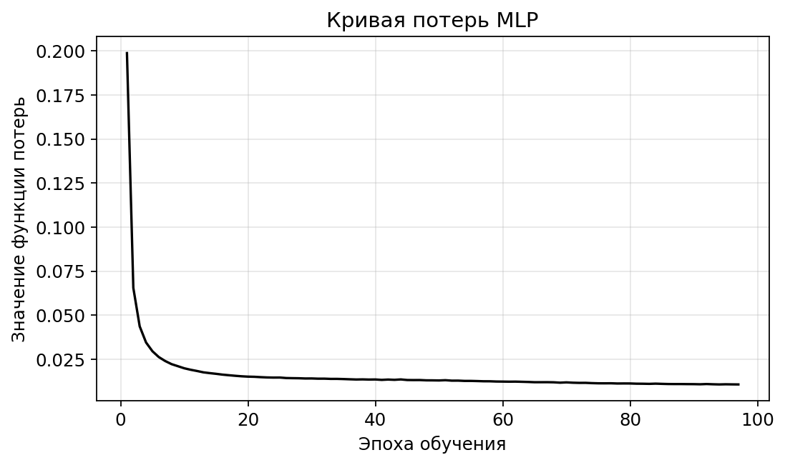

*Рисунок 2.31 — Кривая значения функции потерь по эпохам обучения
итоговой модели MLP*

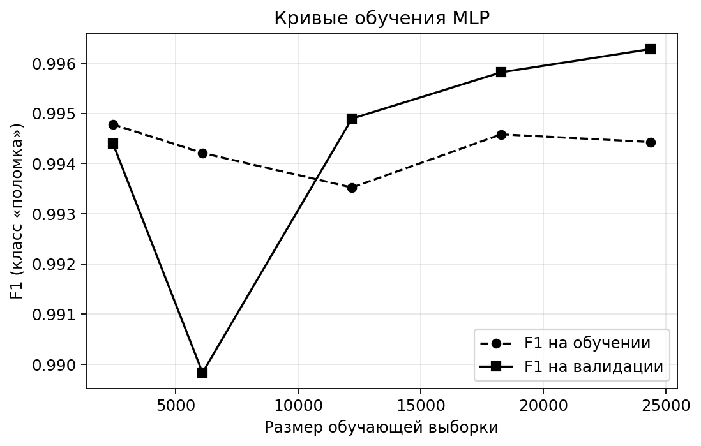

*Рисунок 2.32 — Кривые обучения: F1 на обучении и валидации в
зависимости от размера обучающей выборки*

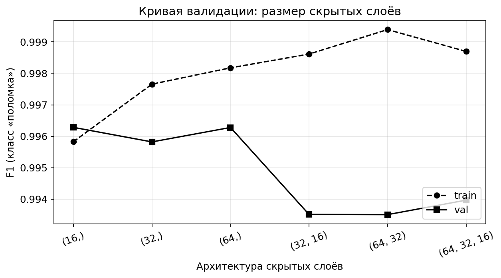

*Рисунок 2.33 — Кривая валидации MLP по размеру скрытых слоёв*

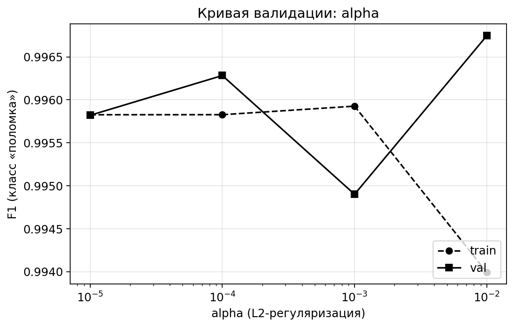

*Рисунок 2.34 — Кривая валидации MLP по параметру L2-регуляризации `alpha`*

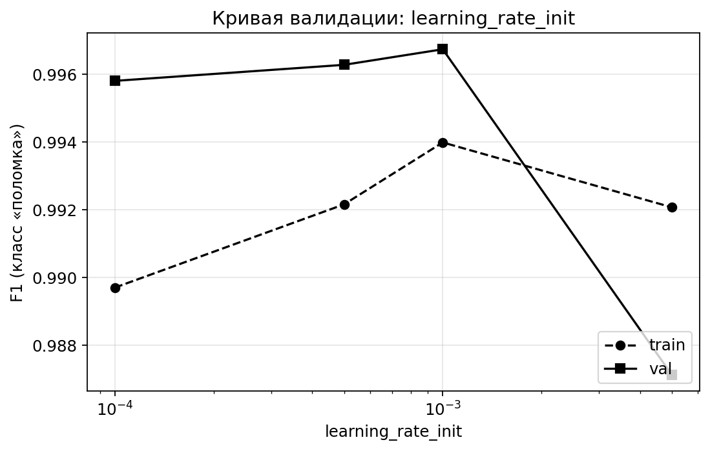

*Рисунок 2.35 — Кривая валидации MLP по начальной скорости обучения*


*Рисунок 2.36 — Матрица ошибок многослойного перцептрона на отложенной
выборке test. Из 3391 окна нормы все распознаны верно; из 1308 окон
поломки сеть ошибается только на одном. Recall класса «поломка»
составляет 1.000, общая точность модели приближается к 100 %.*

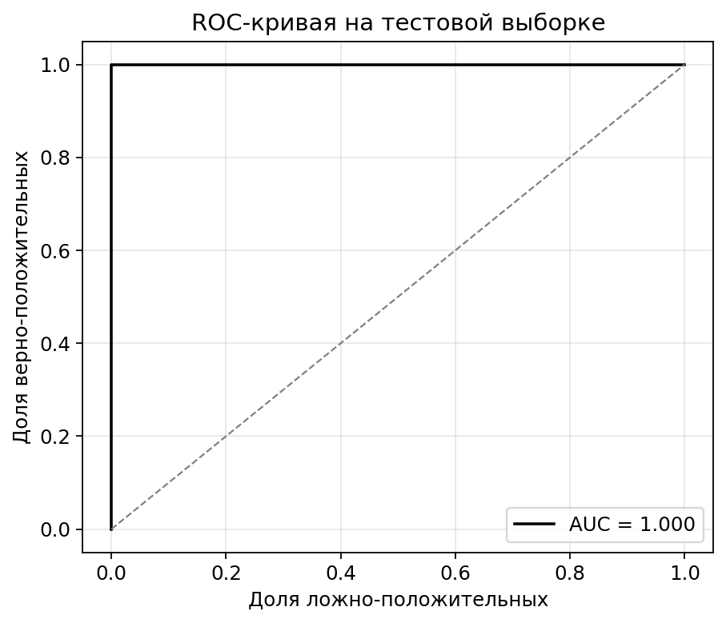

*Рисунок 2.37 — ROC-кривая многослойного перцептрона. Площадь под
кривой ROC-AUC = 1.000, что свидетельствует о практически идеальной
разделяющей способности модели.*

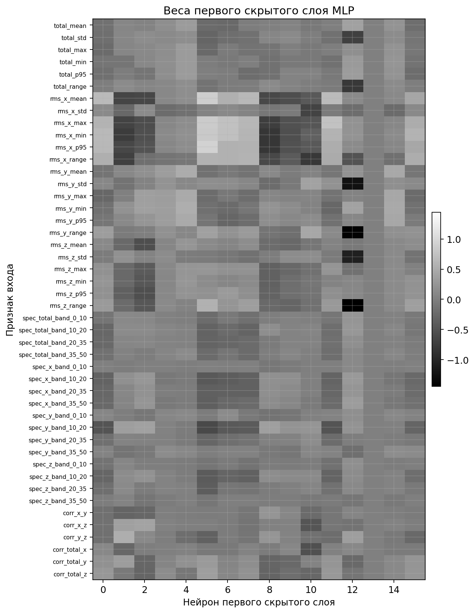

*Рисунок 2.38 — Карта весов первого скрытого слоя MLP: строки —
46 признаков на входе, столбцы — 16 нейронов скрытого слоя, яркость
показывает знак и величину связи*

## 2.4.4. Кросс-валидация по полётам

Чтобы исключить зависимость итогового результата от конкретного
разбиения данных, проведена кросс-валидация по схеме `GroupKFold(5)`,
в которой группой выступает идентификатор полёта `flight_id`. Это
гарантирует, что окна одного полёта целиком попадают либо в обучающую,
либо в тестовую часть фолда, и метрики не завышаются за счёт утечки
данных между фолдами. Гиперпараметры моделей оставлены без изменения
(подобраны на отдельной валидации, см. таблицы 2.2, 2.4, 2.6—2.7).

Алгоритм кросс-валидации представлен в скрипте `cross_validate.py`.
Сводные результаты по 5 фолдам приведены в таблице 2.9.

**Таблица 2.9 — Результаты GroupKFold(5) по полётам
(среднее ± стандартное отклонение)**

| Модель | F1 (поломка) | Precision | Recall | Accuracy | AUC |
|--------|--------------|-----------|--------|----------|-----|
| Decision Tree | 0.989 ± 0.012 | 0.989 ± 0.010 | 0.990 ± 0.018 | 0.994 ± 0.008 | 0.994 ± 0.011 |
| Random Forest | 0.992 ± 0.011 | 0.995 ± 0.008 | 0.989 ± 0.021 | 0.995 ± 0.007 | 0.997 ± 0.007 |
| MLP           | 0.989 ± 0.013 | 0.993 ± 0.008 | 0.987 ± 0.026 | 0.994 ± 0.008 | 1.000 ± 0.000 |

Полные значения метрик по каждому фолду содержатся в
`docs/cross_validation.md`. На рисунке 2.39 представлены распределения
F1 и AUC по 5 фолдам в виде «ящиков с усами», на рисунке 2.40 —
сводная столбчатая диаграмма с усреднёнными значениями метрик и
доверительными интервалами в виде стандартного отклонения.

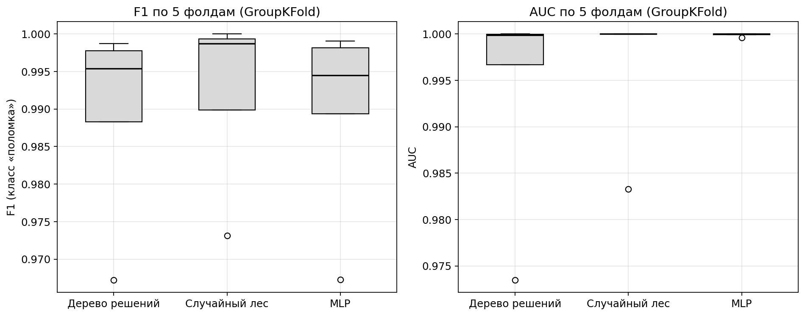

*Рисунок 2.39 — Распределения F1 и AUC по 5 фолдам GroupKFold*

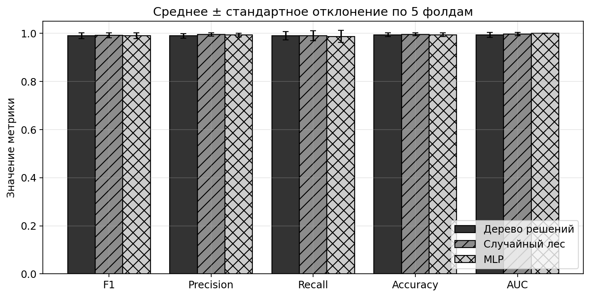

*Рисунок 2.40 — Среднее значение метрик и стандартное отклонение по
5 фолдам GroupKFold*

## 2.4.5. Итоговое сравнение методов

Итоговое сравнение всех трёх методов проведено на независимой
выборке `dataset_for_test`, которая не использовалась ни в обучении,
ни в валидации, ни в кросс-валидации. Выборка собрана из 10
деформированных полётов, отобранных случайно из числа исключённых при
балансировке, и 4 нормальных полётов, собранных отдельно. У нормальных
полётов обрезаны по 20 % с каждого края (взлёт/посадка), чтобы
исключить переходные режимы. Итог — **14 полётов, 2 759 окон**
(1 268 норма / 1 491 поломка). Для каждого окна все три обученные
модели применены к одному и тому же потоку признаков, рассчитанному
по той же схеме (`WINDOW_SIZE = 10`, `STEP = 5`), что и при обучении.
Алгоритм проверки представлен в скрипте `eval_dataset_for_test.py`
и блок-схемой `schemes/eval_dataset_for_test_scheme.json`. Результаты
сведены в таблицу 2.10.

**Таблица 2.10 — Сравнение методов на независимой выборке
`dataset_for_test`**

| Модель | F1 (поломка) | Precision | Recall | Accuracy | AUC |
|--------|--------------|-----------|--------|----------|-----|
| Decision Tree | 0.985 | 0.994 | 0.976 | 0.984 | 0.988 |
| Random Forest | 0.983 | 0.986 | 0.981 | 0.982 | 0.997 |
| MLP           | **0.989** | **0.995** | **0.983** | **0.988** | **0.999** |

Сравнительный график (рисунок 2.41) визуализирует значения всех пяти
метрик для трёх моделей. Детальные матрицы ошибок и ROC-кривые
по каждой модели содержатся в `images/dataset_for_test/`.


*Рисунок 2.41 — Сравнение методов на независимой выборке
`dataset_for_test` по пяти метрикам качества*

На основании результатов сравнения сформулировано следующее
заключение. MLP показал наилучшие результаты на независимой выборке
`dataset_for_test`: F1 = 0.989, Recall = 0.983 (наивысший среди трёх
методов), AUC = 0.999. При кросс-валидации `GroupKFold(5)` MLP даёт
ROC-AUC ровно 1.000 ± 0.000 — модель идеально разделяет классы по
ранжированию. Этот результат объясняется двумя факторами:

- архитектурой `Input(46) → StandardScaler → Dense(16, ReLU) →
  Dense(1, Sigmoid)`, способной аппроксимировать сложные нелинейные
  зависимости вибрационного сигнала и совместные изменения нескольких
  спектральных характеристик одновременно;
- комплексной регуляризацией (стандартизация на входе,
  L2-регуляризация `alpha = 0.01`, ранняя остановка по неубыванию
  функции потерь), которая предотвратила переобучение под конкретные
  полёты обучающей выборки и обеспечила перенос качества на ранее не
  виденные полёты.

Random Forest показал близкий результат (F1 = 0.983 на
`dataset_for_test`, среднее F1 = 0.992 по кросс-валидации), уступив
MLP в среднем на 0.6 процентных пункта по F1. Уступание объясняется
тем, что решающие деревья разбивают пространство признаков осевыми
гиперплоскостями по одному признаку за узел, тогда как неисправные
режимы винта характеризуются совместным изменением нескольких
спектральных коэффициентов — это лучше моделируется нелинейными
активациями MLP, чем мажоритарным голосованием по осевым отсечкам.

Decision Tree (F1 = 0.985 на `dataset_for_test`, среднее F1 = 0.989
по кросс-валидации) — интерпретируемая модель: путь от корня к листу
читается как последовательный набор правил по конкретным признакам
вибрации. В сравнении с ансамблем и нейросетью эта модель проигрывает
по показателю Recall, но сохраняет роль интерпретируемой базы
сравнения и инструмента отладки набора признаков.

На основании этого заключения для дальнейшей работы выбран метод с
использованием многослойного перцептрона. Реальное время работы
выбранного метода обеспечивается отдельным детектором
`realtime_mlp_detector.py`, который принимает данные с датчика
Xsens MTi-30 по протоколу UART и применяет ту же обученную модель
`models/method_mlp.pkl` к скользящему окну признаков. Алгоритм
реального времени представлен блок-схемой
`schemes/realtime_mlp_scheme.json`.
