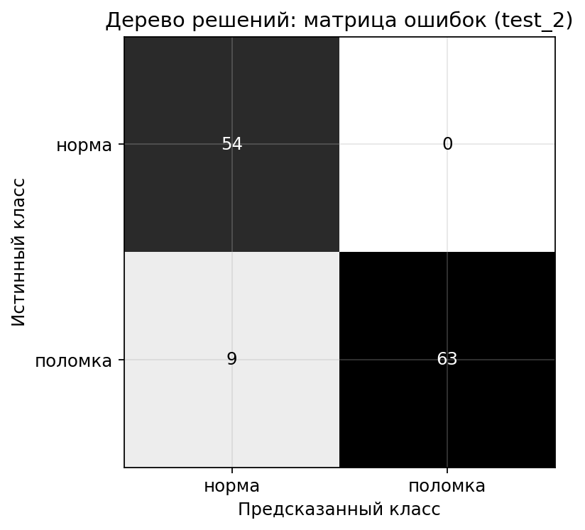
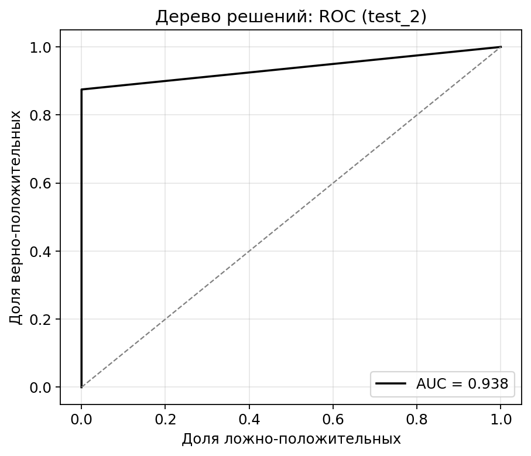
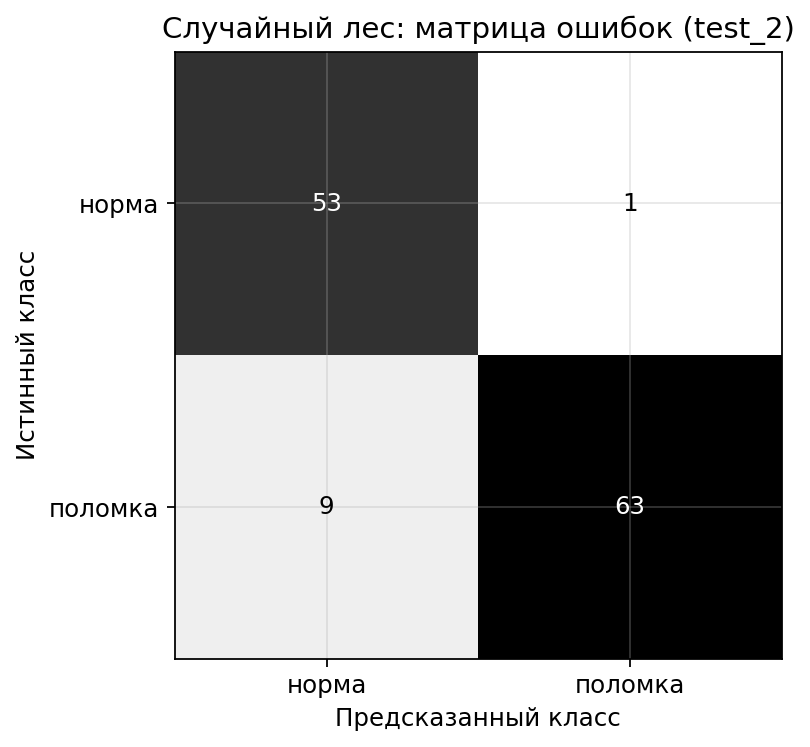
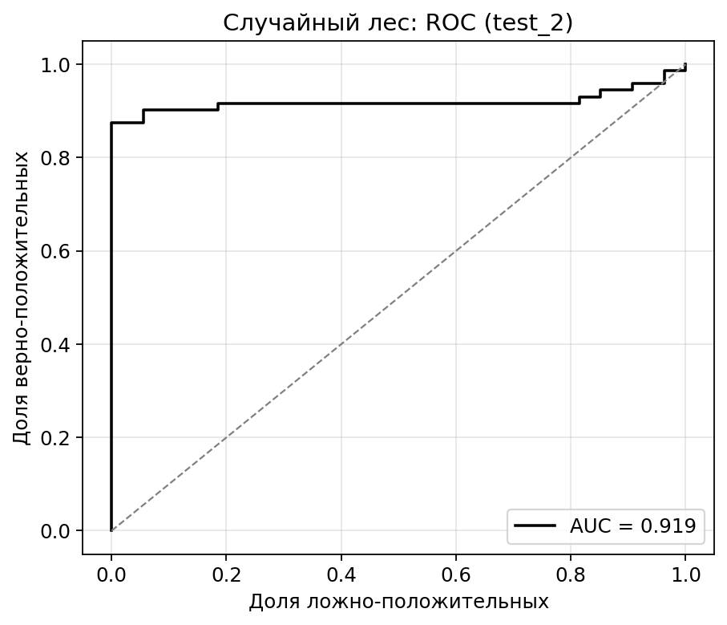
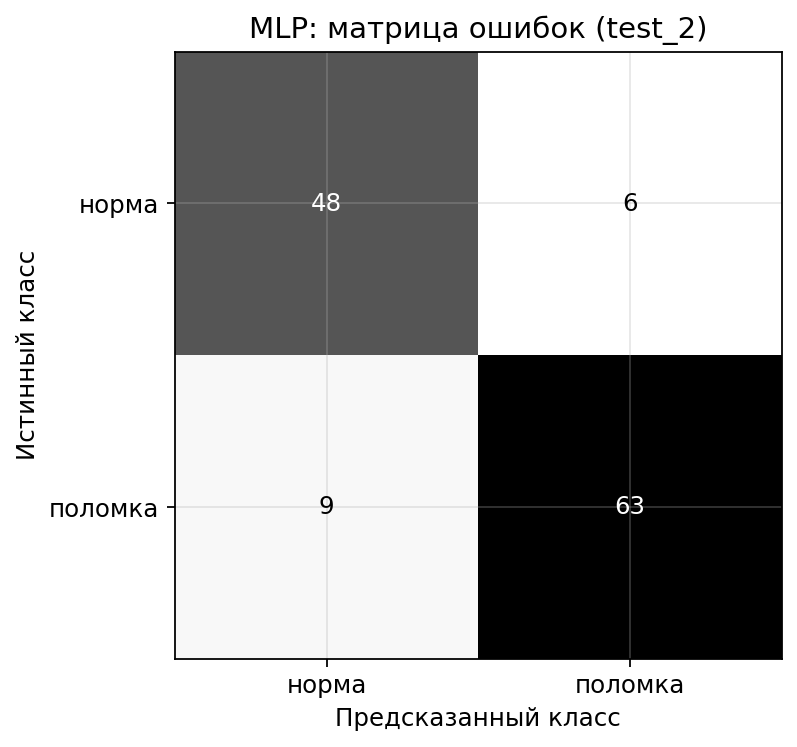
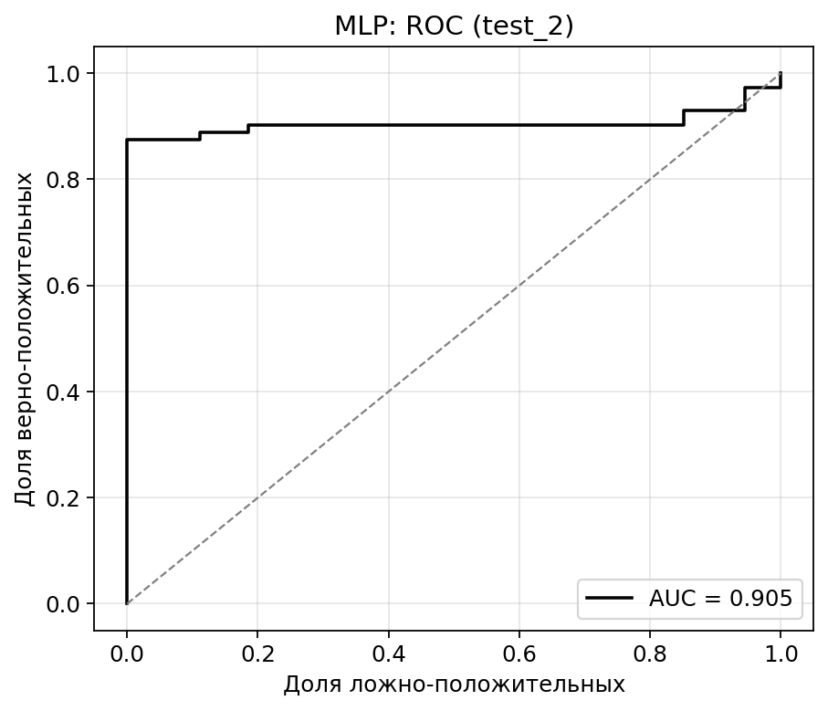

# Результаты на независимой выборке test_2
Назначение выборки: проверка обобщающей способности моделей и подозрения на утечку данных. test_2 состоит из полётов новой даты (5 мая 2026), которых нет ни в train, ни в val, ни в test.
## Состав выборки
- окон всего: 126;
- норма: 54;
- поломка: 72;
- уникальных полётов: 14.
## Сводная таблица
| Модель | F1 (поломка) | Precision | Recall | Accuracy | AUC |
|--------|--------------|-----------|--------|----------|-----|
| Дерево решений | 0.933 | 1.000 | 0.875 | 0.929 | 0.938 |
| Случайный лес | 0.926 | 0.984 | 0.875 | 0.921 | 0.919 |
| MLP | 0.894 | 0.913 | 0.875 | 0.881 | 0.905 |

## Детальные отчёты
### Дерево решений
```
              precision    recall  f1-score   support

       норма      0.857     1.000     0.923        54
     поломка      1.000     0.875     0.933        72

    accuracy                          0.929       126
   macro avg      0.929     0.938     0.928       126
weighted avg      0.939     0.929     0.929       126

```



### Случайный лес
```
              precision    recall  f1-score   support

       норма      0.855     0.981     0.914        54
     поломка      0.984     0.875     0.926        72

    accuracy                          0.921       126
   macro avg      0.920     0.928     0.920       126
weighted avg      0.929     0.921     0.921       126

```



### MLP
```
              precision    recall  f1-score   support

       норма      0.842     0.889     0.865        54
     поломка      0.913     0.875     0.894        72

    accuracy                          0.881       126
   macro avg      0.878     0.882     0.879       126
weighted avg      0.883     0.881     0.881       126

```



