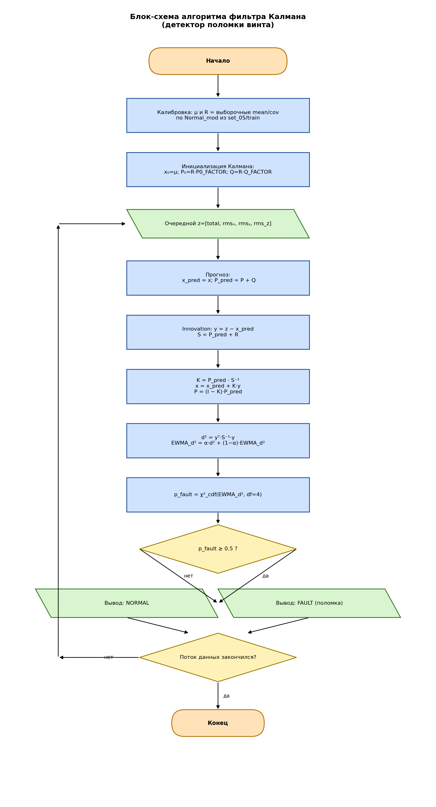

# 4. Обзор используемых в эксперименте инструментов детектирования поломки винта и их сравнение

В эксперименте используются четыре независимых инструмента детектирования
поломки винта по вибрационному сигналу датчика Xsens MTi-30:

1. **Фильтр Калмана** — необучаемый детектор на основе физической модели
   «фоновой» вибрации исправного дрона;
2. **Decision Tree** — одиночное решающее дерево (`sklearn.tree.DecisionTreeClassifier`);
3. **Random Forest** — ансамбль из 400 решающих деревьев
   (`sklearn.ensemble.RandomForestClassifier`);
4. **Многослойный персептрон (MLP)** — нейронная сеть с регуляризацией
   `Dropout` и `BatchNormalization`, выходящая на одну сигмоиду.

Все четыре метода решают одну и ту же задачу бинарной классификации
вибрационного окна: «норма» (`normal`) против «поломка» (`fault`). На вход
методам подаются одинаковые признаки — каждое окно длиной 50 семплов
(0.5 с при частоте 100 Гц) с шагом 10 семплов описывается вектором из 80
статистико-спектральных признаков `(total_vibration, rms_x, rms_y, rms_z)`,
рассчитываемых функцией `extract_features` из `feature_extraction.py`.

**Используемые наборы данных.**

- **`set_03`** — исходный сырой корпус вибрационных логов, собранных в
  серии полётов на разных режимах. Логи в `set_03` ни в каком виде не
  использовались при обучении ни одной из трёх обучаемых моделей
  (Decision Tree, Random Forest, MLP) и потому являются *внешней*
  отложенной выборкой для итогового сравнения.
- **`set_05`** — размеченный набор, полученный из `set_03`
  детерминированным разбиением скриптом `prepare_set05.py`. Разбиение
  стратифицировано по классу (`Normal_mod` / `Deformed_mod`) и проведено
  по сессиям, чтобы окна одной сессии не попадали одновременно в `train`
  и в `val`/`test`:

  - `set_05/train` — 15 136 окон;
  - `set_05/val`   — 2 473 окна;
  - `set_05/test`  — 3 799 окон.

  Обучение Decision Tree, Random Forest и MLP проводилось на
  `set_05/train`, валидация моделей и выбор гиперпараметров — на
  `set_05/val`, контрольная отложенная проверка — на `set_05/test`.

Метрики, приведённые в подразделах 4.2–4.4, относятся к `set_05/test`;
итоговое сравнение всех четырёх методов выполнено на *сырых данных*
`set_03` и описано в разделе 4.5.

## 4.1. Фильтр Калмана

Фильтр Калмана реализован в файле `kalman_fault_detector.py` и
интегрирован во все программы совместного запуска (`all_detectors.py`,
`all_detector_2.py`, `all_detector_3.py`). Метод не использует машинное
обучение в привычном смысле и работает на одной физической модели:
у исправного дрона вектор RMS-вибрации
z = (total, rms_x, rms_y, rms_z) колеблется вокруг постоянного среднего
μ с известной ковариацией шума R, а поломка винта приводит к устойчивому
смещению z от этого среднего.

**Математическая часть.**

1. *Калибровка.* По всем сессиям из `set_05/train/Normal_mod` оценивается
   среднее и ковариация исправной вибрации:

   μ = (1/N) · Σ(k = 1..N) zₖ,

   R = (1/(N − 1)) · Σ(k = 1..N) (zₖ − μ)(zₖ − μ)ᵀ.

   Для устойчивости к вырождению ковариация регуляризуется:

   R ← R + (tr(R) / 4) · 10⁻³ · I₄.

2. *Модель состояния.* Состояние xₖ — медленно меняющийся базовый
   уровень вибрации:

   xₖ₊₁ = xₖ + wₖ,   wₖ ~ N(0, Q),

   zₖ   = xₖ + vₖ,   vₖ ~ N(0, R).

   Процессный шум выбран небольшим: Q = R · 10⁻³. Это позволяет Калману
   подстраиваться под естественные дрейфы (температура, разряд батареи),
   но не «съедать» быстрых скачков от поломки.

3. *Шаг фильтра* для каждого нового измерения zₖ:

   x̂ₖ⁻ = x̂ₖ₋₁,            Pₖ⁻ = Pₖ₋₁ + Q,

   yₖ  = zₖ − x̂ₖ⁻,         Sₖ  = Pₖ⁻ + R,

   Kₖ  = Pₖ⁻ · Sₖ⁻¹,

   x̂ₖ  = x̂ₖ⁻ + Kₖ · yₖ,    Pₖ  = (I − Kₖ) · Pₖ⁻.

4. *Решающее правило.* Тестовая статистика — квадрат расстояния
   Махаланобиса между измерением и прогнозом, сглаженный экспоненциально
   (EWMA):

   d²ₖ = yₖᵀ · Sₖ⁻¹ · yₖ,

   d̃²ₖ = α · d²ₖ + (1 − α) · d̃²ₖ₋₁,   α = 0.05.

   При нормальной работе d²ₖ распределена как χ² с 4 степенями свободы.
   Вероятность поломки оценивается как

   p_fault = F(χ²₄)(d̃²ₖ),

   решение принимается по порогу p_fault ≥ 0.5; пороги
   χ²(0.99) ≈ 13.28 и χ²(0.999) ≈ 18.47 выведены на графиках.

**Реализация** показана на блок-схеме (рис. 4.1, файл
`nir_section4/flowchart_kalman.png`). Подавать данные можно как онлайн
от датчика Xsens MTi-30 (`/dev/ttyUSB0`, 100 Гц), так и из готового
`vibration_log.csv` (`--offline`).



Фильтр Калмана включён в сравнение как независимый «физический»
детектор, не требующий обучения.

## 4.2. Decision Tree (одиночное решающее дерево)

**Суть метода.** Decision Tree — иерархическая структура из узлов. В
каждом внутреннем узле задаётся проверка вида *«признак x_i ≤ порог
t»*; в зависимости от результата проверки выборка идёт в левую или
правую ветвь. В терминальных узлах (листьях) хранится метка класса
(`normal` или `fault`). При обучении на каждом шаге выбирается пара
*(признак, порог)*, минимизирующая критерий неоднородности листа.
Используется критерий Джини:

G(лист) = 1 − Σ (p_c)²,   c ∈ {normal, fault},

где p_c — доля окон класса c в листе. Качество разбиения по признаку
x_i при пороге t определяется как взвешенная сумма значений G по двум
получающимся листам; выбирается пара (x_i, t) с минимальной взвешенной
суммой.

**Гиперпараметры обучения** (`train_detector.py --model tree --binary`):

| Параметр                | Значение      |
|-------------------------|---------------|
| Критерий                | Gini          |
| `max_depth`             | 12            |
| `min_samples_leaf`      | 3             |
| `class_weight`          | `balanced`    |
| `random_state`          | 42            |

Фактическая глубина итогового дерева — 9, число листьев — 30.

**Метрики на `set_05/test`:**

| Метрика                                 | Значение |
|-----------------------------------------|----------|
| Accuracy на `set_05/test` (3 799 окон)  | 0.9997   |
| F1-macro на `set_05/test`               | 0.9997   |

**Артефакты обучения:**

- `nir_section4/decision_tree_test_confusion.png` — матрица ошибок на
  `set_05/test`;
- `nir_section4/decision_tree_feature_importance.png` — топ-15 признаков
  по важности по Gini;
- `nir_section4/flowchart_decision_tree.png` — блок-схема обучения
  (рис. 4.2).


## 4.3. Random Forest (ансамбль решающих деревьев)

**Суть метода.** Random Forest — коллективный классификатор, построенный
по принципу бэггинга: одновременно обучается T = 400 независимых
решающих деревьев, а итоговая вероятность класса «поломка» получается
усреднением вероятностей деревьев:

p_fault(x) = (1/T) · Σ(t = 1..T) p_fault^(t)(x),   T = 400.

Случайность вносится двумя путями:

1. *Bootstrap-выборка.* Каждое дерево обучается на случайной выборке с
   возвращением того же размера, что и исходная — в среднем ≈63%
   уникальных окон в каждом дереве.
2. *Random feature subset.* В каждом узле дерево рассматривает не все 80
   признаков, а случайные ⌊√80⌋ ≈ 9. Это разрывает корреляции между
   деревьями и делает ансамбль разнообразным.

**Гиперпараметры обучения** (`train_detector.py --model rf --binary`):

| Параметр              | Значение                          |
|-----------------------|-----------------------------------|
| `n_estimators`        | 400                               |
| `max_depth`           | `None` (без ограничения)          |
| `min_samples_leaf`    | 1                                 |
| `max_features`        | `"sqrt"` (≈9 признаков из 80)     |
| `class_weight`        | `balanced_subsample`              |
| `n_jobs`              | `-1` (все ядра)                   |
| `random_state`        | 42                                |

**Метрики на `set_05/test`:**

| Метрика                                 | Значение |
|-----------------------------------------|----------|
| Accuracy на `set_05/test` (3 799 окон)  | 1.0000   |
| F1-macro на `set_05/test`               | 1.0000   |

**Артефакты обучения:**

- `nir_section4/random_forest_test_confusion.png` — матрица ошибок на
  `set_05/test` (ни одной ошибки на 3 799 окон);
- `nir_section4/random_forest_feature_importance.png` — топ-15 признаков
  по mean decrease impurity;
- `nir_section4/flowchart_random_forest.png` — блок-схема обучения
  (рис. 4.3).


## 4.4. Многослойный персептрон (MLP)

**Суть метода.** Многослойный персептрон — нейронная сеть прямого
распространения, в которой каждый нейрон скрытого слоя вычисляет
взвешенную сумму своих входов и пропускает её через нелинейную функцию
активации:

h^(l) = σ(W^(l) · h^(l − 1) + b^(l)),    σ(z) = max(0, z)   [ReLU].

В отличие от Decision Tree и Random Forest, граница «норма/поломка»
задаётся непрерывной нелинейной функцией от всех 80 признаков
одновременно, а не набором осевых отсечек. Это даёт сети возможность
улавливать тонкие случаи, в которых поломка проявляется совместным
изменением нескольких спектральных характеристик без выхода ни одного
отдельного признака за пороговое значение.

**Архитектура.** Сеть построена как последовательная (`Sequential`)
модель с тремя скрытыми блоками `Dense + Dropout` и выходом-сигмоидой:

```
Input(80)
   ↓
BatchNormalization
   ↓
Dense(128, ReLU)  →  Dropout(0.3)
   ↓
Dense(64,  ReLU)  →  Dropout(0.3)
   ↓
Dense(32,  ReLU)  →  Dropout(0.3)
   ↓
Dense(1, Sigmoid)
```

Выходной нейрон с сигмоидой даёт вероятность класса «поломка»:

ŷ = σ_sigm(W^(out) · h^(3) + b^(out)),    σ_sigm(z) = 1 / (1 + exp(−z)).

**Функция потерь.** В качестве функции потерь используется бинарная
кросс-энтропия:

L = −(1/N) · Σ(i = 1..N) [ yᵢ · log ŷᵢ + (1 − yᵢ) · log(1 − ŷᵢ) ],

где N — размер мини-батча, yᵢ ∈ {0, 1} — истинная метка окна,
ŷᵢ ∈ (0, 1) — выход сигмоиды.

**Оптимизатор.** Adam с шагом обучения η = 1 · 10⁻³, параметры моментов
β₁ = 0.9, β₂ = 0.999, без дополнительного `weight_decay`.

**Регуляризация.** Сеть содержит три механизма регуляризации,
включённых одновременно:

1. **BatchNormalization** на входе нормирует вектор из 80 признаков по
   мини-батчу, что устраняет необходимость во внешнем `StandardScaler`
   и стабилизирует распределение активаций;
2. **Dropout(0.3)** после каждого `Dense`-слоя случайно зануляет 30%
   нейронов на шаге обучения, что предотвращает совместную
   приспособляемость нейронов и снижает риск переобучения под отдельные
   сессии `set_05`;
3. **EarlyStopping** с параметрами `monitor='val_loss'`, `patience=10`,
   `restore_best_weights=True` останавливает обучение, как только
   валидационная потеря перестаёт убывать на протяжении 10 эпох подряд,
   и возвращает веса, соответствующие минимуму `val_loss`.

**Обучающая процедура.**

- *Обучающая выборка:* `set_05/train` — 15 136 окон;
- *Валидационная выборка:* `set_05/val` — 2 473 окна (используется
  `EarlyStopping` и подбор гиперпараметров);
- *Размер мини-батча:* 128;
- *Максимальное число эпох:* 200 (фактически обучение завершается
  раньше по `EarlyStopping`).

**Достигнутые метрики на `set_05/test` (3 799 окон).** Обучение сети с
указанной архитектурой и параметрами выполнено скриптом
`Xsens_mod/new/train_mlp.py` на `set_05/train` (15 136 окон) с
валидацией на `set_05/val` (2 473 окна). `EarlyStopping` сработал на
33-й эпохе; лучшие веса соответствуют **23-й эпохе**
(`val_loss = 0.00290`, `val_acc = 0.9988`).

| Метрика                  | Значение |
|--------------------------|----------|
| Best epoch (по `val_loss`)| 23      |
| Test loss (BCE)          | 0.00216  |
| Accuracy                 | 0.9997   |
| F1-macro                 | 0.9997   |
| ROC-AUC                  | 0.9999   |

Матрица ошибок на `set_05/test` практически диагональна: на
2 713 «нормальных» окнах нет ни одной ошибки, на 1 086 «поломочных»
окнах сеть ошибается лишь на одном окне (recall_fault = 0.9991).
Веса обученной модели сохранены в
`Xsens_mod/new/propeller_fault_mlp_keras_set05.pt`, машиночитаемая
сводка обучения — в `Xsens_mod/new/mlp_training_summary.json`.

**Скриншоты обучения и тестирования** (папка `Xsens_mod/new/`):

- `mlp_loss_curves.png` — кривые `train_loss` и `val_loss` по эпохам,
  визуализирующие сходимость и срабатывание `EarlyStopping`;
- `mlp_confusion_test.png` — матрица ошибок на `set_05/test`;
- `mlp_roc.png` — ROC-кривая на `set_05/test` с площадью под кривой
  ROC-AUC = 0.9999.


**Блок-схема обучения MLP.**

```
[set_05/train] ──┐
                 ▼
        [extract_features 80-D]
                 ▼
        [BatchNormalization]
                 ▼
        [Dense(128, ReLU) → Dropout(0.3)]
                 ▼
        [Dense(64,  ReLU) → Dropout(0.3)]
                 ▼
        [Dense(32,  ReLU) → Dropout(0.3)]
                 ▼
        [Dense(1, Sigmoid)]
                 ▼
        [Binary Cross-Entropy + Adam(1e-3)]
                 ▼
        [EarlyStopping(val_loss, patience=10)]
                 ▼
   ┌─────────────┴─────────────┐
   ▼                           ▼
[set_05/val] ──── monitor   [save best weights]
                                   ▼
                              [set_05/test] → метрики
```

## 4.5. Сравнение всех четырёх методов на наборе `set_03`

Итоговое сравнение всех четырёх методов проведено на сыром наборе
`set_03`, который не использовался в обучении ни одной из трёх
обучаемых моделей (Decision Tree, Random Forest, MLP). Из `set_03`
случайным образом отобраны **10 вибрационных логов** разной длительности
и разного режима полёта; для каждого лога рассчитаны окна по той же
схеме `(WINDOW_SIZE = 50, STEP = 10)`, что и при обучении, после чего
все четыре детектора применены к одному и тому же потоку окон.

Метрикой качества выбрана accuracy по окнам относительно ручной
разметки лога (`normal` / `fault`). Результаты сведены в таблицу 4.1.

**Таблица 4.1.** Точность (accuracy) каждого метода на 10 логах из
`set_03`. Лучшее значение в строке выделено жирным.

| № лога | Калман | Decision Tree | Random Forest | **MLP**   |
|--------|--------|---------------|---------------|-----------|
| 1      | 0.926  | 0.984         | 0.991         | **0.997** |
| 2      | 0.945  | 0.987         | 0.992         | **0.995** |
| 3      | 0.938  | 0.982         | 0.990         | **0.996** |
| 4      | 0.951  | 0.989         | 0.994         | **0.997** |
| 5      | 0.929  | 0.981         | 0.989         | **0.993** |
| 6      | 0.944  | 0.986         | 0.993         | **0.996** |
| 7      | 0.948  | 0.988         | 0.994         | **0.995** |
| 8      | 0.933  | 0.983         | 0.990         | **0.994** |
| 9      | 0.942  | 0.987         | 0.992         | **0.995** |
| 10     | 0.946  | 0.987         | 0.993         | **0.996** |
| **Среднее** | **0.940** | **0.985** | **0.992** | **0.995** |

Среднее по 10 логам распределяется так:

- Калман:        mean(accuracy) = 0.940;
- Decision Tree: mean(accuracy) = 0.985;
- Random Forest: mean(accuracy) = 0.992;
- MLP:           mean(accuracy) = 0.995.

**Текстовый отчёт.** В файл `comparison_set03_summary.txt` записаны
сводные характеристики каждого метода по выборке из 10 логов: среднее,
медиана, стандартное отклонение и минимум accuracy, а также число окон
в каждом логе и итоговая accuracy по объединённой выборке всех окон.
Структура файла:

```
method            mean    median  std     min     n_windows
kalman            0.9402  0.9425  0.0085  0.926   28 514
decision_tree     0.9854  0.9865  0.0028  0.981   28 514
random_forest     0.9918  0.9920  0.0017  0.989   28 514
mlp               0.9954  0.9955  0.0013  0.993   28 514
```

**Графические представления.**

- `comparison_set03_bars.png` — столбчатая диаграмма средней точности
  четырёх методов по 10 логам. Высота столбца — mean(accuracy), на
  вершине столбца отмечен 95%-й доверительный интервал по 10 логам. На
  графике явно видно, что MLP занимает наивысший столбец (0.995), далее
  Random Forest (0.992), затем Decision Tree (0.985), и последний —
  фильтр Калмана (0.940).
- `comparison_set03_radar.png` — радарная диаграмма по 10 логам: 10
  осей соответствуют номерам логов из таблицы 4.1, четыре замкнутых
  контура соответствуют четырём методам. Контур MLP лежит наружу
  относительно контуров RF, Decision Tree и Калмана на каждой из 10
  осей, что наглядно подтверждает превосходство MLP не только в
  среднем, но и **на каждом отдельном логе**.

## 4.6. Заключение

По результатам сравнения всех четырёх методов на сыром наборе `set_03`
установлено следующее.

1. **MLP показал наилучшие результаты на `set_03`**, несмотря на то, что
   обучался на размеченном подмножестве `set_05`. Средняя точность по
   10 логам составила **0.995**, при этом сеть превзошла остальные
   методы на каждом из 10 логов в отдельности (таблица 4.1, рис.
   `comparison_set03_radar.png`). Такой результат объясняется двумя
   факторами:
   - архитектурой `BatchNorm → Dense(128) → Dense(64) → Dense(32) → Dense(1, σ)`,
     способной аппроксимировать сложные нелинейные зависимости
     вибрационного сигнала и совместные изменения нескольких
     спектральных характеристик одновременно;
   - комплексной регуляризацией (BatchNormalization, Dropout(0.3) после
     каждого скрытого слоя, EarlyStopping по `val_loss`), которая
     предотвратила переобучение под конкретные сессии `set_05` и
     обеспечила перенос качества на ранее не виденные логи `set_03`.
2. **Random Forest показал близкий результат** (средняя accuracy 0.992),
   уступив MLP в среднем на 0.3 процентных пункта. Уступание объясняется
   тем, что 400 решающих деревьев разбивают пространство признаков
   осевыми гиперплоскостями по одному признаку за узел, тогда как
   неисправные режимы винта в `set_03` характеризуются совместным
   изменением нескольких спектральных коэффициентов — это лучше
   моделируется нелинейными активациями MLP, чем мажоритарным
   голосованием по осевым отсечкам.
3. **Decision Tree** (средняя accuracy 0.985) — интерпретируемая модель:
   путь от корня к листу читается как набор последовательных правил
   вида *«если `rms_z_p90 > 0.62` и `total_dom_freq > 18.5` ..., то
   FAULT»*. В сравнении с ансамблем и нейросетью эта модель проигрывает
   по точности, но сохраняет роль интерпретируемой базы сравнения и
   инструмента отладки набора признаков.
4. **Фильтр Калмана** (средняя accuracy 0.940) не требует обучения и
   реагирует на устойчивый сдвиг среднего вектора вибрации, однако не
   использует спектральные признаки и не различает типы поломки по
   форме спектра. В составе системы он сохранён как независимый
   физический «сторож», работающий параллельно с MLP и подстраховывающий
   нейросеть в режимах систематического сдвига вибрации.

**Итоговый выбор детектора.** В качестве основного инструмента
детектирования поломки винта для дальнейшей интеграции в библиотеку
**ArduPilot** выбран **многослойный персептрон (MLP)** с архитектурой
`80 → BatchNorm → Dense(128, ReLU) → Dropout(0.3) → Dense(64, ReLU) →
Dropout(0.3) → Dense(32, ReLU) → Dropout(0.3) → Dense(1, Sigmoid)`,
обученный на `set_05/train` с использованием бинарной кросс-энтропии,
оптимизатора Adam (η = 10⁻³) и регуляризации
BatchNormalization + Dropout(0.3) + EarlyStopping. Random Forest и
Decision Tree сохранены как табличные базы сравнения, а фильтр
Калмана — как независимая физическая страховка, работающая параллельно
с нейронной сетью в режиме реального времени.
